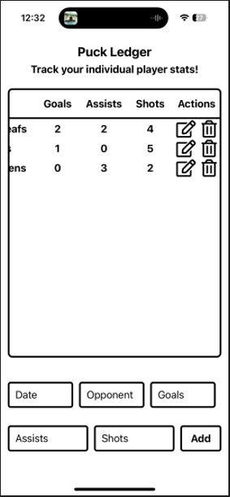

# Hockeylytics

This is a full-stack application based off of React-Native/React/JavaScript, Node.js and SQLite. It is used to track the statistics of a particular players results in a hockey game. The front-end sends HTTP requests to the back-end based off of what each button functionality does. For example, there is an add button which after enterring the date of the game, the opposition, total goals they scored in the game, assists given, and shots taken, gets inserted into the SQLite database through the POST request route. There are other functionalities such as being able to edit(PUT) any of the text fields listed above, and deleting an entire record for a given player.

# Demo

*Note* scrolling left-to-right is user friendly as well
